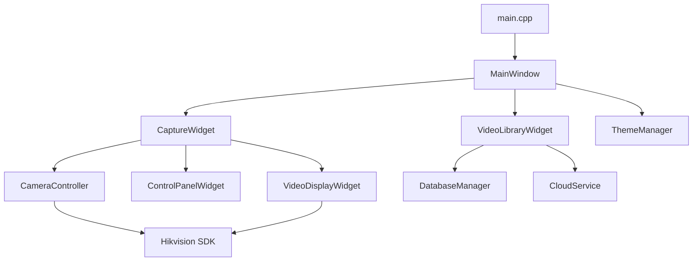

# WormVision Qt 项目架构文档

## 概述

WormVision 是一个基于 Qt6 和海康威视 SDK 的工业相机采集系统，用于显微镜线虫观测实验。

## 技术栈

| 组件 | 技术 |
|------|------|
| **UI 框架** | Qt 6.8 (Widgets) |
| **数据库** | SQLite (via Qt Sql) |
| **网络** | Qt Network |
| **相机 SDK** | 海康威视 MVS SDK |
| **构建系统** | CMake + Ninja |
| **C++ 标准** | C++17 |

---

## 项目结构

```
src/
├── main.cpp                    # 应用入口
├── mainwindow.h/.cpp           # 主窗口
├── services/
│   ├── CameraController.h/.cpp # 相机控制器
│   └── CloudService.h/.cpp     # 云端服务
├── widgets/
│   ├── VideoDisplayWidget.h/.cpp    # SDK 直接渲染显示
│   ├── CaptureWidget.h/.cpp         # 采集视图
│   ├── ControlPanelWidget.h/.cpp    # 参数控制面板
│   └── VideoLibraryWidget.h/.cpp    # 视频库管理
├── data/
│   └── DatabaseManager.h/.cpp  # SQLite 数据库管理
└── utils/
    └── ThemeManager.h/.cpp     # 主题管理
```

---

## 模块详解

### 1. MainWindow 主窗口

**文件**: `src/mainwindow.h/.cpp`

**功能**:
- 视图切换（采集视图 / 视频库视图）
- 工具栏管理
- 主题切换

**实现方式**:
- 使用 `QStackedWidget` 管理多视图
- 通过 `QAction` 实现工具栏按钮
- 加载 QSS 样式表实现主题切换

---

### 2. CameraController 相机控制器

**文件**: `src/services/CameraController.h/.cpp`

**功能**:

| 功能 | 实现方式 |
|------|----------|
| 相机连接 | `MV_CC_OpenDevice` / `MV_CC_CloseDevice` |
| 图像采集 | `MV_CC_StartGrabbing` + 独立线程轮询 |
| SDK 直接渲染 | `MV_CC_DisplayOneFrameEx` 渲染到窗口句柄 |
| 曝光控制 | `MV_CC_SetFloatValue("ExposureTime", value)` |
| 增益控制 | `MV_CC_SetFloatValue("Gain", value)` |
| 帧率控制 | `MV_CC_SetFloatValue("AcquisitionFrameRate", value)` |
| Binning 控制 | `MV_CC_SetIntValue("BinningHorizontal/Vertical", value)` |
| 视频录制 | `MV_CC_StartRecord` / `MV_CC_InputOneFrame` / `MV_CC_StopRecord` |

**关键信号**:
- `frameRendered(int frameIdx)` - SDK 渲染完成后通知
- `recordingStarted/Stopped(QString path)` - 录制状态变化
- `parameterChanged(QString, float)` - 参数变化通知
- `cameraOpened/cameraClosed` - 连接状态变化

**线程模型**:
- `grabLoop()` 在独立 `std::thread` 中运行
- 通过 `std::atomic<bool>` 控制启停
- SDK 帧获取后直接调用 `MV_CC_DisplayOneFrameEx` 渲染

---

### 3. VideoDisplayWidget 视频显示

**文件**: `src/widgets/VideoDisplayWidget.h/.cpp`

**功能**:
- 提供原生窗口句柄供 SDK 直接渲染
- EMA 算法计算平滑 FPS

**实现方式**:

| 功能 | 实现 |
|------|------|
| 禁用 Qt 绑定 | `setAttribute(Qt::WA_PaintOnScreen)` + `paintEngine()` 返回 `nullptr` |
| 获取窗口句柄 | `winId()` 返回 HWND |
| FPS 统计 | 使用 EMA (指数移动平均) 算法，α=0.1 |
| 帧间隔测量 | `QElapsedTimer.restart()` 返回毫秒间隔 |

**EMA 算法**:
```cpp
float instantFps = 1000.0f / elapsedMs;
m_smoothFps = 0.1f * instantFps + 0.9f * m_smoothFps;
```

---

### 4. CaptureWidget 采集视图

**文件**: `src/widgets/CaptureWidget.h/.cpp`

**功能**:
- 整合视频显示和控制面板
- 预览控制（开始/停止）
- 录制控制（开始/停止）
- 抓拍功能（待实现）
- 录制时长显示

**UI 布局**:
```
┌─────────────────────────────┬──────────────┐
│                             │              │
│      VideoDisplayWidget     │ ControlPanel │
│      (SDK 直接渲染)          │   (参数)     │
│                             │              │
├─────────────────────────────┴──────────────┤
│ [开始预览] [停止预览] [抓拍] [任务名] [开始录制] [停止录制] │
│ FPS: 23.5  帧数: 1234  预览中...                      │
└────────────────────────────────────────────┘
```

**录制流程**:
1. 点击"开始录制" → 调用 `CameraController::startRecording()`
2. SDK 内部编码写入 AVI 文件
3. 点击"停止录制" → 调用 `CameraController::stopRecording()`
4. `recordingStopped` 信号触发 → 将视频信息写入数据库

---

### 5. ControlPanelWidget 参数控制面板

**文件**: `src/widgets/ControlPanelWidget.h/.cpp`

**功能**:
- 曝光时间调节 (滑块 + SpinBox)
- 增益调节 (滑块 + SpinBox)
- 帧率调节 (滑块 + SpinBox)
- Binning 选择 (下拉框)

**参数范围获取**:
- 从 `CameraController` 获取 SDK 返回的实际范围
- 动态设置滑块和 SpinBox 的 min/max 值

**双向绑定**:
- 滑块变化 → 更新 SpinBox 显示 → 发出信号
- SpinBox 变化 → 更新滑块位置 → 发出信号

---

### 6. VideoLibraryWidget 视频库

**文件**: `src/widgets/VideoLibraryWidget.h/.cpp`

**功能**:

| 功能 | 实现方式 |
|------|----------|
| 视频列表显示 | `QTableWidget` 表格控件 |
| 扫描视频文件夹 | `QDir::entryInfoList()` |
| AVI 时长解析 | 直接读取 AVI 文件头 (RIFF/avih) |
| 文件大小格式化 | `formatFileSize()` KB/MB/GB |
| 批量删除 | 遍历选中项执行删除 |
| 批量上传 | 调用 `CloudService::uploadFile()` |
| 右键菜单 | `customContextMenuRequested` 信号 |

**AVI 时长解析算法**:
```cpp
// 读取文件前 256 字节
// 定位 "avih" 标签
// 读取 dwMicroSecPerFrame (每帧微秒)
// 读取 dwTotalFrames (总帧数)
// 时长(秒) = totalFrames × microSecPerFrame / 1,000,000
```

**表格列**:
| 列 | 内容 |
|----|------|
| 0 | 复选框 |
| 1 | 文件名 |
| 2 | 时长 (MM:SS) |
| 3 | 大小 (MB) |
| 4 | 上传状态 |

---

### 7. DatabaseManager 数据库管理

**文件**: `src/data/DatabaseManager.h/.cpp`

**功能**:
- SQLite 数据库初始化
- 视频记录 CRUD 操作
- 单例模式

**数据表结构** (`videos`):

| 字段 | 类型 | 说明 |
|------|------|------|
| id | INTEGER | 主键 |
| filename | TEXT | 文件名 |
| filepath | TEXT | 完整路径 (UNIQUE) |
| duration | INTEGER | 时长(秒) |
| filesize | INTEGER | 文件大小(字节) |
| created_at | DATETIME | 创建时间 |
| upload_status | TEXT | 上传状态 (NONE/UPLOADED) |
| workspace_id | INTEGER | 工作空间 ID |

**主要方法**:
- `insertVideo(VideoInfo)` - 插入新视频
- `getAllVideos()` - 获取所有视频
- `updateVideoMetadataByPath(path, duration, filesize)` - 更新元数据
- `deleteVideo(id)` - 删除视频

---

### 8. CloudService 云端服务

**文件**: `src/services/CloudService.h/.cpp`

**功能**:
- 获取工作空间列表
- 上传视频文件

**信号**:
- `workspacesFetched(QList<WorkspaceInfo>)`
- `uploadProgress(QString filePath, int percent)`
- `uploadFinished(QString filePath, bool success, QString msg)`
- `errorOccurred(QString msg)`

**状态**: 接口已定义，具体实现待完善（需要后端 API）

---

### 9. ThemeManager 主题管理

**文件**: `src/utils/ThemeManager.h/.cpp`

**功能**:
- 深色/浅色主题切换
- 加载 QSS 样式表

**实现方式**:
- 样式表存储在 `resources/styles/dark.qss` 和 `light.qss`
- 通过 `qApp->setStyleSheet()` 全局应用

---

## 关键技术实现

### SDK 直接渲染 (零拷贝)

```
┌───────────┐    ┌───────────────┐    ┌──────────────────┐
│  相机     │───→│  SDK 帧缓冲    │───→│  D3D/GDI 渲染    │
│ (Hikvision)    │  (GPU DMA)    │    │  (直接到 HWND)   │
└───────────┘    └───────────────┘    └──────────────────┘
                                              │
                                              ↓
                                     ┌──────────────────┐
                                     │ VideoDisplayWidget│
                                     │  (Qt 禁用绑定)    │
                                     └──────────────────┘
```

**优势**:
- CPU 占用极低 (~1%)
- 与海康 MVS 软件性能一致
- 无帧跳过，全帧率显示

### SDK 录制

```cpp
// 开始录制
MV_CC_StartRecord(handle, &recordParam);  // AVI 格式

// grabLoop 中每帧调用
MV_CC_InputOneFrame(handle, &frameInfo);  // 喂帧给编码器

// 停止录制
MV_CC_StopRecord(handle);
```

---

## 依赖关系图



---

## 构建与运行

### 构建命令

```powershell
# 使用构建脚本
.\scripts\build.ps1
```

### 运行

```powershell
.\build\WormVision.exe
```

---

## 待实现功能

1. **抓拍功能** - 使用 `MV_CC_SaveImage` 从相机缓冲区直接保存图像
2. **云端上传** - 完善 `CloudService` 与后端 API 对接
3. **设备授权** - Mode B 设备授权流程
