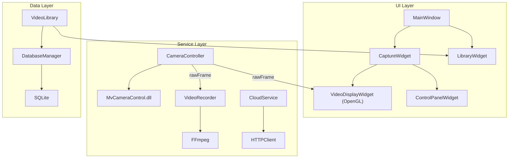
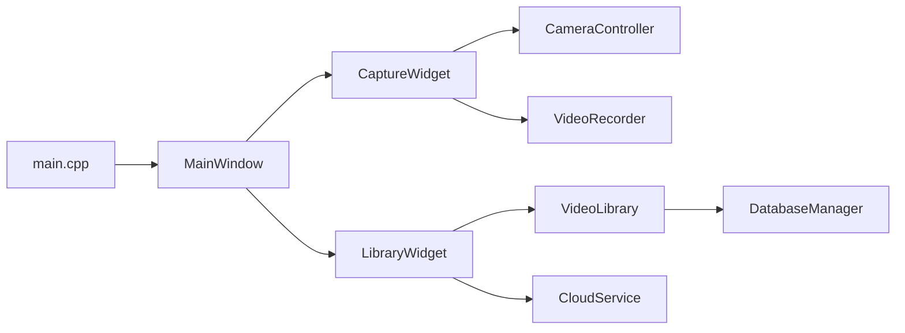

# WormVision C++/Qt 重写技术规格报告

**版本**: 1.0  
**日期**: 2026-01-16  
**目标**: 基于现有 Electron + Python 实现，提供完整的 C++/Qt 6 重写方案  
**受众**: AI Agent 与开发工程师

---

## 📊 执行摘要

本项目是一款工业相机采集应用，当前使用 Electron (前端) + Python (后端驱动) 架构。虽已优化至 17% CPU @ 23 FPS，但受限于 Web 渲染与 IPC 开销，无法达到 MVS 原生应用的 ~1% CPU 水平。

**重写方案**: 使用 **C++ 17** + **Qt 6** 完全重建，直接调用海康威视 SDK，实现原生 GPU 渲染。

**预期成果**:
- CPU 占用: **< 3%** (预览)
- 帧率: **满帧率 (23 FPS)**
- 包体积: **< 30 MB** (对比 Electron 150+ MB)
- 启动时间: **< 1 秒**

---

## 1. 🏗️ 现有功能完整清单

通过代码审查，识别出以下所有功能模块：

### 1.1 模块 A: 相机控制 (Camera Module)

| 功能 | 现有实现位置 | C++ 对应类 |
|------|-------------|-----------|
| 相机枚举与打开 | `py_driver/main_service.py::CameraService.start_camera()` | `CameraController` |
| 启动/停止预览 | `start_camera()`, `stop_camera()` | `CameraController::startPreview()` |
| 实时图像采集 | `_grab_loop()` | `CameraController::grabLoop()` |
| **降采样预览流** | `np.frombuffer...array[::2,::2]` | `ImageProcessor::downsample()` |
| 曝光时间设置 | `set_param('exposure', value)` | `CameraSettings::setExposure()` |
| 增益设置 | `set_param('gain', value)` | `CameraSettings::setGain()` |
| 帧率设置 | `set_param('frameRate', value)` | `CameraSettings::setFrameRate()` |
| Binning 设置 | `set_param('binning', value)` | `CameraSettings::setBinning()` |
| 相机重连机制 | `_reconnect()` | `CameraController::reconnect()` |

**关键技术点**:
- 直接调用 `MvCameraControl.dll` (无需 Python/ctypes 中间层)
- 使用 Qt 线程 (`QThread`) 执行采集循环
- 信号槽传递帧数据到 UI 层

### 1.2 模块 B: 视频录制 (Recording Module)

| 功能 | 现有实现位置 | C++ 对应类 |
|------|-------------|-----------|
| 开始录制 | `start_recording(filename)` | `VideoRecorder::start()` |
| 停止录制 | `stop_recording()` | `VideoRecorder::stop()` |
| 视频编码 | OpenCV `VideoWriter` (H.264/avc1) | `VideoRecorder` (FFmpeg/OpenCV) |
| 录制时长统计 | `cameraStore.ts::recordingDuration` | `VideoRecorder::getDuration()` |
| 录制文件命名 | `{timestamp}_{experimentName}.mp4` | `VideoRecorder::generateFilename()` |

**关键技术点**:
- 使用 FFmpeg C API 或 OpenCV `cv::VideoWriter`
- 录制线程与采集线程共享原始帧 (保持全分辨率)

### 1.3 模块 C: 单帧抓拍 (Snapshot Module)

| 功能 | 现有实现位置 | C++ 对应类 |
|------|-------------|-----------|
| 抓拍当前帧 | `cameraStore.ts::captureSnapshot()` | `SnapshotManager::capture()` |
| 保存为图像 | 前端创建 Canvas -> dataURL -> 下载 | `cv::imwrite()` 或 `QImage::save()` |

### 1.4 模块 D: 视频库管理 (Library Module)

| 功能 | 现有实现位置 | C++ 对应类 |
|------|-------------|-----------|
| 扫描视频文件夹 | `FileService.ts::scanVideoFolder()` | `VideoLibrary::scan()` |
| 视频列表展示 | `LibraryView.vue`, `libraryStore.ts` | `VideoLibraryWidget` (QTableView) |
| 视频预览播放 | HTML5 `<video>` 标签 | `QMediaPlayer` + `QVideoWidget` |
| 视频删除 | `FileService::deleteVideo()` | `VideoLibrary::deleteVideo()` |
| 视频重命名 | `FileService::renameVideo()` | `VideoLibrary::renameVideo()` |
| 打开文件位置 | `shell.showItemInFolder()` | `QDesktopServices::openUrl()` |

### 1.5 模块 E: 数据库服务 (Database Module)

| 功能 | 现有实现位置 | C++ 对应类 |
|------|-------------|-----------|
| SQLite 连接 | `DatabaseService.ts` (better-sqlite3) | `DatabaseManager` (Qt SQL) |
| 视频表 CRUD | `insertVideo`, `getVideoById`, etc. | `VideoRepository` |
| 索引优化 | `idx_videos_filepath`, `idx_videos_workspace` | 同 |

**数据库表结构**:
```sql
CREATE TABLE videos (
    id INTEGER PRIMARY KEY AUTOINCREMENT,
    filename TEXT NOT NULL,
    filepath TEXT NOT NULL UNIQUE,
    duration INTEGER DEFAULT 0,
    filesize INTEGER NOT NULL,
    created_at DATETIME DEFAULT CURRENT_TIMESTAMP,
    upload_status TEXT DEFAULT 'NONE' CHECK(upload_status IN ('NONE', 'UPLOADED')),
    workspace_id INTEGER
);
```

### 1.6 模块 F: 云端上传 (Cloud Module)

| 功能 | 现有实现位置 | C++ 对应类 |
|------|-------------|-----------|
| 获取工作区列表 | `CloudService.ts::fetchWorkspaces()` | `CloudService::fetchWorkspaces()` |
| 上传文件 | `CloudService.ts::uploadFile()` | `CloudService::uploadFile()` |
| 上传进度回调 | `onProgress` callback | Qt 信号: `uploadProgress(int percent)` |
| 批量上传 | `libraryStore::uploadVideos()` | `CloudService::uploadBatch()` |

**注意**: 当前实现为 **Mock**，实际需对接后端 API。

### 1.7 模块 G: UI 交互 (UI Module)

| 功能 | 现有实现位置 | Qt 对应组件 |
|------|-------------|-----------|
| 主窗口布局 | `App.vue` + 路由 | `MainWindow` (QMainWindow) |
| 采集视图 | `CaptureView.vue` | `CaptureWidget` |
| 控制面板 | `CameraControlPanel.vue` | `ControlPanelWidget` |
| 视频画布 | `VideoCanvas.vue` | `VideoDisplayWidget` (QOpenGLWidget) |
| 浮动工具栏 (缩放) | `FloatingToolbar.vue` | `ZoomToolBar` |
| 视频库视图 | `LibraryView.vue` | `LibraryWidget` |
| 主题切换 | `ThemeSwitch.vue`, `themeStore.ts` | `ThemeManager` (QSS 动态加载) |

---

## 2. 🧱 C++/Qt 架构设计

### 2.1 整体架构图



### 2.2 模块依赖图



### 2.3 目录结构 (建议)

```
wormvision-qt/
├── CMakeLists.txt
├── src/
│   ├── main.cpp
│   ├── mainwindow.cpp/h
│   ├── widgets/
│   │   ├── CaptureWidget.cpp/h
│   │   ├── LibraryWidget.cpp/h
│   │   ├── VideoDisplayWidget.cpp/h   # OpenGL 渲染
│   │   └── ControlPanelWidget.cpp/h
│   ├── services/
│   │   ├── CameraController.cpp/h
│   │   ├── VideoRecorder.cpp/h
│   │   └── CloudService.cpp/h
│   ├── data/
│   │   ├── DatabaseManager.cpp/h
│   │   └── VideoLibrary.cpp/h
│   └── utils/
│       ├── ThemeManager.cpp/h
│       └── Logger.cpp/h
├── resources/
│   ├── styles/
│   │   ├── dark.qss
│   │   └── light.qss
│   └── icons/
├── libs/
│   └── hikvision/   # MvCameraControl SDK headers & libs
└── tests/
    ├── test_camera.cpp
    ├── test_database.cpp
    └── test_video_recorder.cpp
```

---

## 3. 📐 详细类设计

### 3.1 CameraController

```cpp
class CameraController : public QObject {
    Q_OBJECT

public:
    explicit CameraController(QObject *parent = nullptr);
    ~CameraController();

    // 相机操作
    bool open();
    void close();
    bool startGrabbing();
    void stopGrabbing();

    // 参数设置
    void setExposure(float microseconds);
    void setGain(float db);
    void setFrameRate(float fps);
    void setBinning(int factor);

signals:
    void frameReady(const QByteArray &rawData, int width, int height, int channels);
    void cameraOpened();
    void cameraClosed();
    void error(const QString &message);

private slots:
    void grabLoop();

private:
    void *m_cameraHandle = nullptr;
    QThread m_grabThread;
    std::atomic<bool> m_isGrabbing{false};
};
```

### 3.2 VideoDisplayWidget (OpenGL)

```cpp
class VideoDisplayWidget : public QOpenGLWidget {
    Q_OBJECT

public:
    explicit VideoDisplayWidget(QWidget *parent = nullptr);

public slots:
    void updateFrame(const QByteArray &rawData, int width, int height, int channels);

protected:
    void initializeGL() override;
    void paintGL() override;
    void resizeGL(int w, int h) override;

private:
    GLuint m_textureId = 0;
    int m_frameWidth = 0;
    int m_frameHeight = 0;
    QMutex m_mutex;
};
```

### 3.3 VideoRecorder

```cpp
class VideoRecorder : public QObject {
    Q_OBJECT

public:
    bool start(const QString &outputPath, int width, int height, float fps);
    void stop();
    bool isRecording() const;
    qint64 duration() const;  // 录制时长 (毫秒)

public slots:
    void writeFrame(const QByteArray &rawData, int width, int height, int channels);

signals:
    void recordingStarted(const QString &path);
    void recordingStopped(const QString &path);
    void error(const QString &message);

private:
    cv::VideoWriter m_writer;
    QElapsedTimer m_timer;
    std::atomic<bool> m_isRecording{false};
};
```

### 3.4 DatabaseManager

```cpp
class DatabaseManager : public QObject {
    Q_OBJECT

public:
    static DatabaseManager &instance();
    bool initialize(const QString &dbPath);
    void close();

    // Video CRUD
    int insertVideo(const VideoInfo &video);
    VideoInfo getVideoById(int id);
    QVector<VideoInfo> getAllVideos();
    bool updateVideo(int id, const VideoInfo &updates);
    bool deleteVideo(int id);

private:
    QSqlDatabase m_db;
};
```

---

## 4. 🧪 单元测试计划

每个模块都需要配套单元测试，使用 **Qt Test** 框架。

### 4.1 测试覆盖范围

| 模块 | 测试类 | 测试用例 |
|------|--------|---------|
| CameraController | `TestCamera` | `test_open_close`, `test_setExposure`, `test_grabLoop` |
| VideoRecorder | `TestRecorder` | `test_start_stop`, `test_writeFrames`, `test_outputFile` |
| DatabaseManager | `TestDatabase` | `test_insertVideo`, `test_getAllVideos`, `test_deleteVideo` |
| VideoLibrary | `TestLibrary` | `test_scan`, `test_rename`, `test_delete` |
| CloudService | `TestCloud` | `test_fetchWorkspaces`, `test_uploadProgress` |

### 4.2 示例测试代码

```cpp
class TestDatabase : public QObject {
    Q_OBJECT

private slots:
    void initTestCase() {
        DatabaseManager::instance().initialize(":memory:");
    }

    void test_insertVideo() {
        VideoInfo video;
        video.filename = "test.mp4";
        video.filepath = "/tmp/test.mp4";
        video.filesize = 1024;

        int id = DatabaseManager::instance().insertVideo(video);
        QVERIFY(id > 0);
    }

    void test_getAllVideos() {
        auto videos = DatabaseManager::instance().getAllVideos();
        QVERIFY(videos.size() >= 1);
    }
};
```

---

## 5. 📈 性能指标定义

### 5.1 必须达成的指标

| 指标 | 目标值 | 测量方法 |
|------|--------|---------|
| **预览 CPU 占用** | < 3% | Windows 任务管理器，稳定运行 1 分钟后读取 |
| **预览帧率** | ≥ 23 FPS | 内部统计，每秒平均值 |
| **预览延时** | < 50ms | 工业相机采集到屏幕显示的端到端延时 |
| **内存占用** | < 100MB | 静态及预览运行时的内存在 Win 任务管理器的数值 |
| **录像 CPU 占用**| < 10% | 稳定录制时增加的 CPU 占用 |

---

## 6. 📅 开发里程碑与分步指令

### 第一步：环境搭建与核心渲染 (Week 1)
- [ ] 配置 CMake 与 Qt 6.5+ 基础工程。
- [ ] 实现 OpenGL 纹理渲染组件 `VideoDisplayWidget`。
- [ ] **Agent 指令**: "请按照规格书 7.2 节配置 CMake，并实现一个可以循环播放测试图片的 OpenGL 渲染组件。"

### 第二步：相机驱动集成 (Week 2)
- [ ] 封装 C SDK 调用逻辑。
- [ ] 实现多线程采集。
- [ ] **Agent 指令**: "参考规格书 3.1 节，使用 FFI 或直接链接方式封装 MvCameraControl.dll，实现预览图像流吐出。"

... (后续步骤详见规格书主体)

---

**文档结束**
